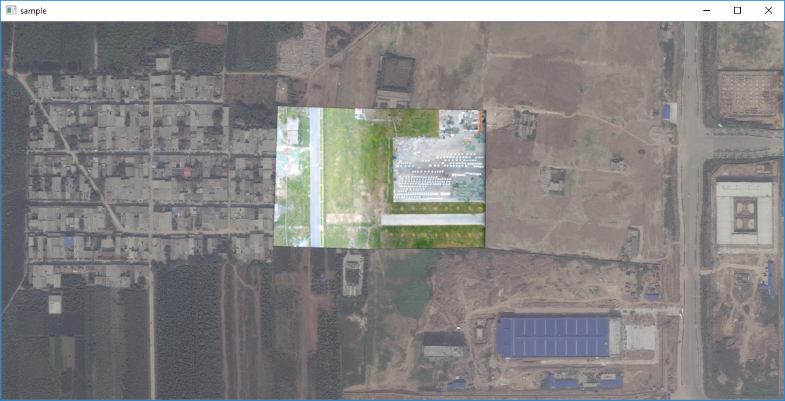
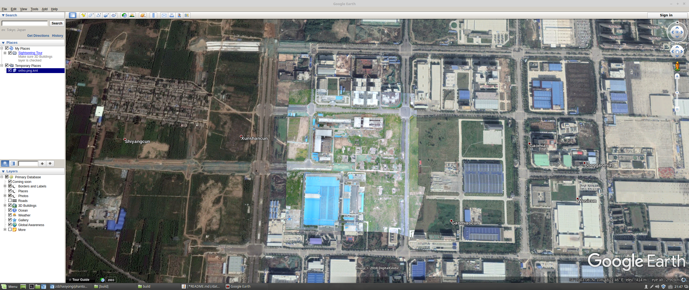

# RTMapperSDK

## 1. Introduction
RTMapperSDK is a cross platform development SDK for [RTMapperDesktop](http://rtmapper.com). It is developed with C++ and now supports both Linux & Windows x64 system enviroment. It use the [GSLAM](https://github.com/zdzhaoyong/GSLAM) which is well designed to support different SLAM & SfM applications with the same APIs. RTMapperSDK needs images with GPS information as input while output both the pointcloud&ortho map at realtime. 

Download from website: http://rtmapper.com

## 2. Compile Sample Code
### 2.1. [Compile on Linux](./doc/develop-linux.md)
### 2.2. [Compile on Windows with CMake+VS2017+Qt5.9.4](./doc/develop-vs2017-qt5.9.md)
### 2.3. [Compile with MinGW64 on Windows](./doc/develop-mingw64.md)

## 3. Usages
### 2.1. Registration
When the SDK is not registed, it can only handle less than 30 keyframes and zoom less than 18. If you want to process more images with higher resolution, registration is needed using [RTMapperDesktop](http://rtmapper.com).

### 2.2. Run with Datasets

1. Run DroneMap Dataset

Download sample dataset with git: 

```
git clone https://github.com/zdzhaoyong/phantom3-village-kfs
```
Run dataset:
```
./sample Dataset=path_of_dataset/phantom3-village-kfs/config.cfg
```

More dronemap datasets can be found at : http://zhaoyong.adv-ci.com/downloads/npu-dronemap-dataset/

2. Run images Dataset

```
./sample conf=_sampletop_/data/mavic-factory/mavic-factory.imgs
```



### 2.3. Demostration of outputs
1. png & kml
png and kml file can be exported with code:
```
tileManager->save("ortho.png");
```

The kml file can be imported to GoogleEarth:



2. tif

tif file can be exported with code:
```
tileManager->save("ortho.tif");
```
The geotiff file can be imported to GIS systems such as ArcGis, QGis .etc.


3. ply

ply file can be exported with code:
```
tileManager->save("sparse.ply");
```
The pointcloud file can be opened with softwares like meshlab.

### 2.4. Parameters

SLAM.isOnline = 0 // 0: offline 2: online
SLAM.nFeature = 1000 // 1000-4000 desired keypoint number
SLAM.LostRestart=10  // seconds slam tryed to relocalize
SLAM.MaxOverlap=0.92 // Overlap percentage

Map2DFusion.CacheFolder= .   // the folder need to be edited mannally
Map2DFusion.Coordinate = GPS // GCJ for GaoDe and GoogleChina
Map2DFusion.MaxZoom    = 19  // The map level of Map2DFusion
Map2DFusion.Thread     = 0   // 0: offline datasets 1: online datasets
Map2DFusion.CacheMB    = 1000// size of map cache, should not be too small


