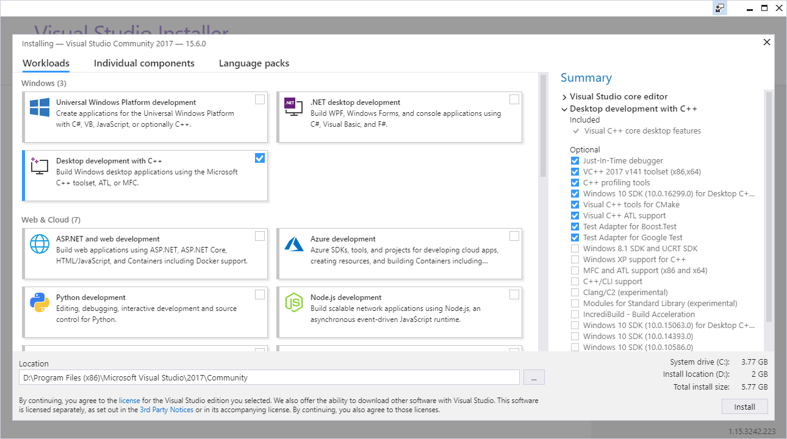
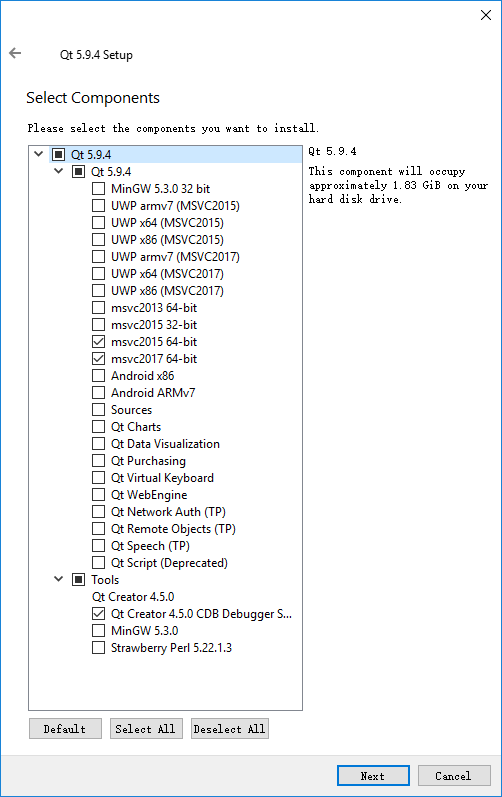
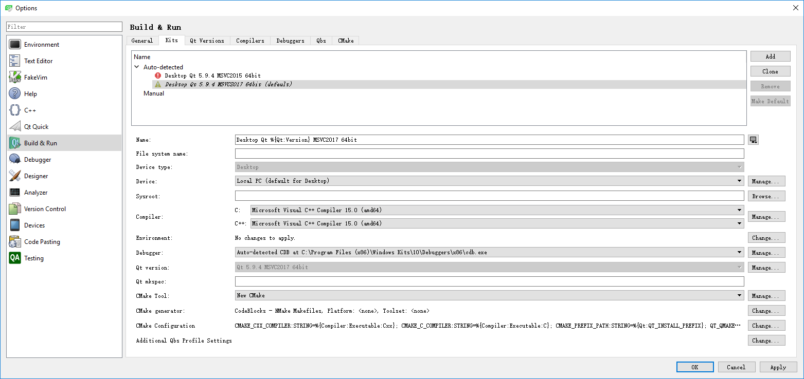
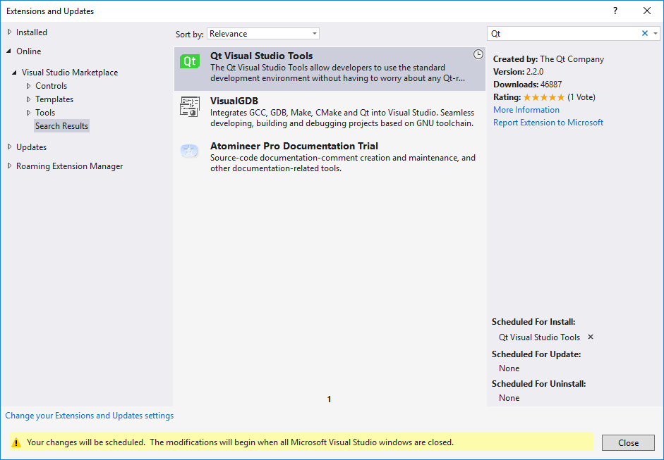
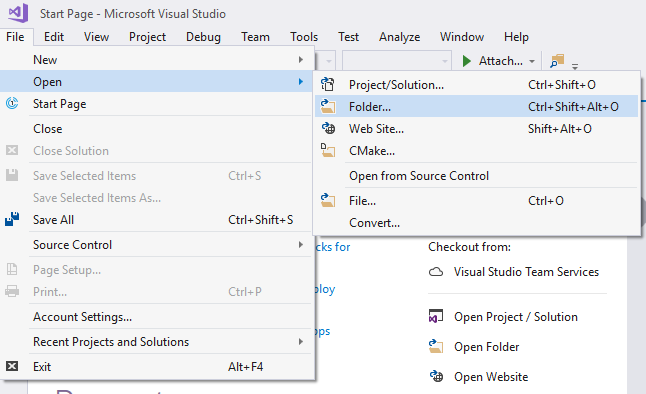
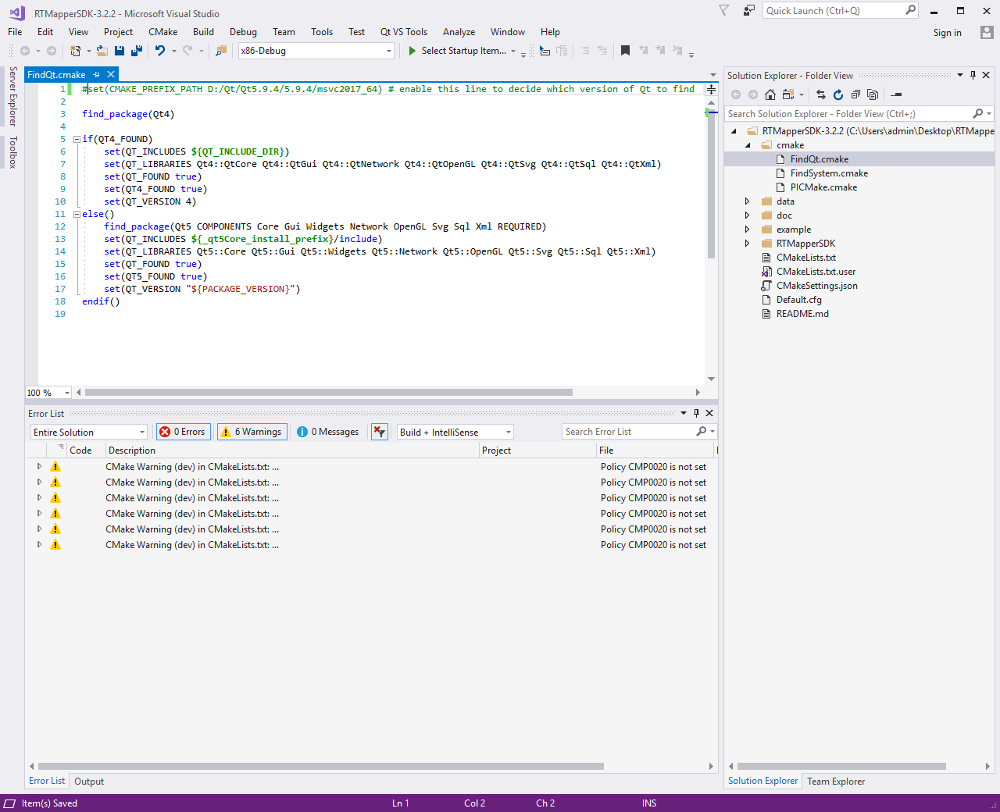
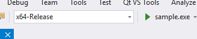

# Compile on Windows with CMake+VS2017+Qt5.9.4

---
## 1. Install Compile Enviroment

There are three things need to be installed:
1. CMake: https://cmake.org/download/
2. VS2017: https://www.visualstudio.com/downloads/
3. Qt5.9.4: http://download.qt.io/archive/qt/

### 1.1. Install CMake

Download the latest cmake version for windows such as **cmake-3.11.0-rc2-win64-x64.msi** and follow the wizard to install.

### 1.2. Install VS2017
Install VS2017 with C++ support:

### 1.3. Install Qt5.9.4
Download file **qt-opensource-windows-x86-5.9.4** and install with vs2017 support:

### 1.4. Configuration of QtCreator
Open QtCreator and go to Menu->Tools->Options->Build&Run->Kits, set **Desktop Qt %{Qt:Version} MSVC2017 64bit** to default and choose amd64 compiler.

### 1.5. Add Qt support for VS2017
Open VS2017 and go to Menu->Tools->Extensions and Updates.
Search Qt in Visual Studio Marketplace, download the plugin for VS and close vs to install.

## 2. Compile and Run
There are several ways to compile the sample code:
1. Open cmake with VS2017
2. Open cmake with QtCreator (recommend)
3. Use cmake to create vs project

### 2.1. Open cmake with VS2017

Choose x64-Release and click Menu->CMake->build all to build the sample.

After sample.exe is built, select sample.exe and run:

Since the application needs qt5 and libRTMapperSDK.dll, please copy these dlls to the location of sample.exe or add PATHs of these folders.

### 2.2. Open cmake with QtCreator (recommend)
Open the CMakeLists.txt with QtCreator, select Release/Minimized Release/Release with debug info compile mode and compile.
Copy RTMapperSDK/lib/vs2015release/libRTMapperSDK.dll to bin/vs.
Run with arguments: conf=_path_/RTMapperSDK-3.2.2/Default.cfg

### 2.3. Use cmake to create vs project

